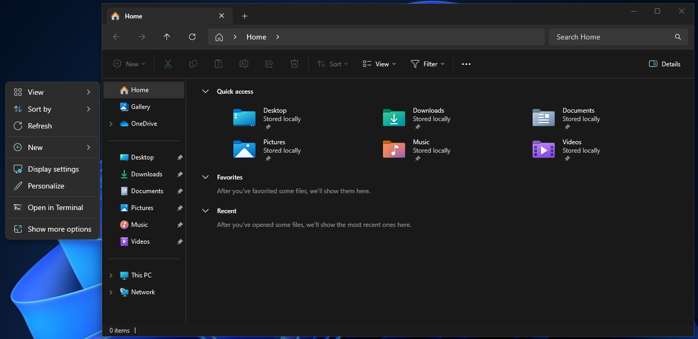
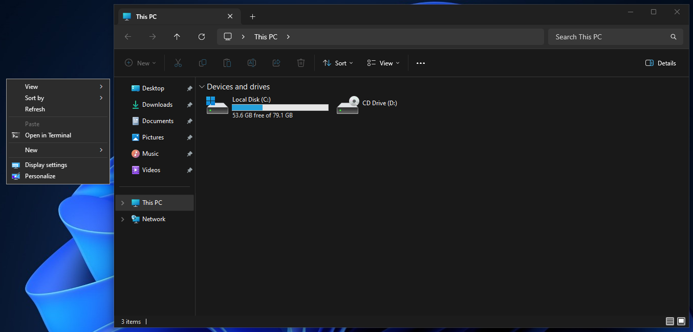

# Win11-Explorer-Fix

<!-- TABLE OF CONTENTS -->

  
Table of Contents

  <ol>
    <li><a href="#about-the-project">About The Project</a></li>
    <li><a href="#contribute">Contribute</a></li>
    <li><a href="#report-a-bug">Report a Bug</a></li>
  </ol>

> [!NOTE]
> NOT FEATURE COMPLETE! MORE TO COME.

> [!WARNING]
> This Script Modifies Your Windows Registry! Use at your own Risk!

<!-- ABOUT THE PROJECT -->
## About The Project

"Fix" the Windows 11 Explorer by removing unnecessary stuff by Modifying the Windows Registry.

Windows Default Explorer:

Changes possible through the script:

<a href="#readme-top">Back to top</a>

<!-- Contribute -->
## Contribute

Contributions are welcome and needed.

<a href="#readme-top">Back to top</a>

<!-- Report a bug -->
## Report a Bug

See the [open issues](https://github.com/Jettcodey/Win11-Explorer-Fix/issues) for a full list of proposed features (and known issues).

### Always report bugs and issues in English! If you report in any other language, your issue will be ignored and closed.

<a href="#readme-top">Back to top</a>

